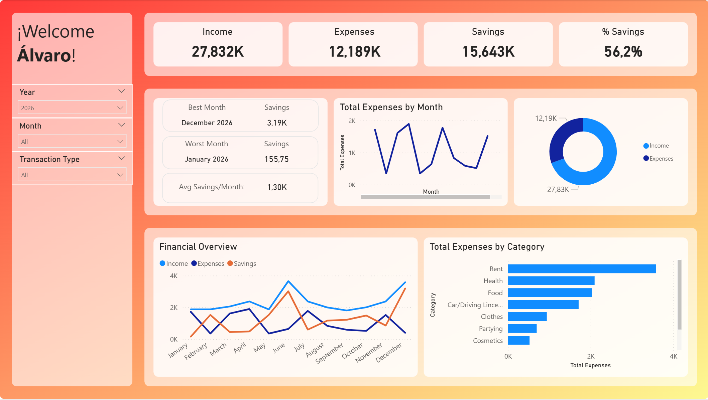
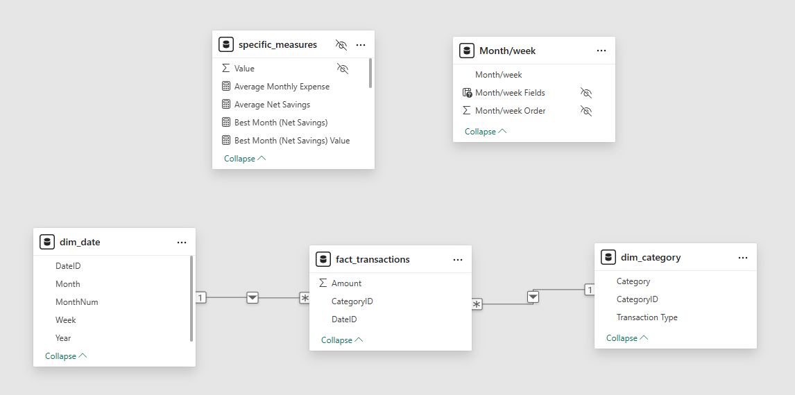
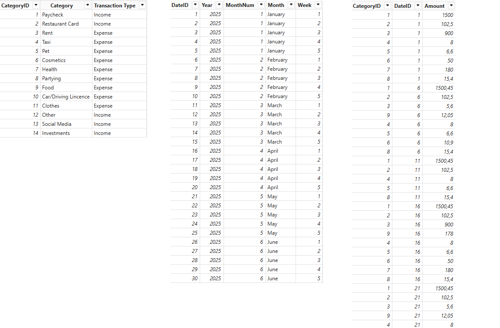

*** Disclaimer ***
**** This project is currently undergoing some major changes, so main branch and the readme won't work exactly as described below ****

# 📊 Personal Finance Data Pipeline & Dashboard



## 🧠 Overview

This project transforms raw Excel-based personal finance data into a structured data model and interactive dashboard.

The goal is to simulate a real-world data pipeline:
- Ingesting raw files
- Cleaning and transforming data
- Building a star schema
- Visualizing insights in Power BI

---

## 🎯 Business Problem

Many people track finances manually in Excel, but lack automated analytics and visualization capabilities. For most users, this is a technical limitation, and they do not want to invest time on acquiring it. As a result, many people limit their financial tracking to Excel spreadsheets without gaining deeper analytical insights from their data.

This project converts raw spreadsheet-based finance tracking into a structured analytical model and interactive BI dashboard, to help people better understand their expenses and how they manage their money.

---

## 👨‍💻 Why I Built This

This project started as a personal initiative inspired by real-world Excel-based finance tracking. I had friends who tracked their finances in Excel spreadsheets and limited themselves to static tables without meaningful analytics or visual insights.

The main goal was to build a useful dashboard that would be easy to set up and use for most non-developer users. It also became an opportunity to practice building an end-to-end analytics workflow combining:
- Python ETL
- Data modeling
- Power BI visualization
- GitHub project structuring

The project evolved into a complete analytics engineering-style pipeline.

## ⚙️ Architecture

Excel Files → Python (Pandas) → CSV (Star Schema) → Power BI Dashboard 

---

## 📌 Live Workflow

Update Excel → Run Python ETL → Refresh Power BI → Dashboard updates instantly

---

## 📥 Data Source

- Excel files containing monthly personal finance data
- Each file represents a year
- Each sheet represents a month
- Weekly structure (Week 1–5)

---

## 🔄 Data Pipeline

### 1. Ingestion
- Reads multiple Excel files from a directory
- Extracts **Year** from file name using regex
- Reads all sheets and assigns **Month**

### 2. Transformation
- Cleans unnecessary rows and columns
- Detects **Transaction Type** (Income vs Expense)
- Unpivots weekly columns into rows
- Standardizes structure

### 3. Data Modeling
Builds a **star schema**:

#### 📊 fact_transactions
- CategoryID
- DateID
- Amount

#### 🧾 dim_category
- CategoryID
- Category
- Transaction Type

#### 📅 dim_date
- DateID
- Year
- Month
- MonthNum
- Week

---

## 📈 Power BI Dashboard

The dashboard provides:

### 💰 KPIs
- Total Income
- Total Expenses
- Net Savings
- Savings Rate

### 📊 Visuals
- Monthly financial trends
- Expense breakdown by category
- Best and worst performing months
- Dynamic drill-down (Month → Week)

### 🎛 Interactivity
- Filters by Year, Month, and Transaction Type

---

## 🧠 Key Features

- Multi-file ingestion (scalable design)
- Dynamic metadata extraction (Year, Month)
- Data normalization using star schema
- Separation of concerns (ingestion, transformation, modeling)
- BI-ready dataset generation

---

## 🚀 How to Run

### 1. Clone the repository

```bash
git clone https://github.com/yourusername/personal-finance-data-pipeline.git
cd personal-finance-data-pipeline
```

---

### 2. Install dependencies

```bash
pip install -r requirements.txt
```

---

### 3. Add raw Excel files

Place Excel files inside:

```plaintext
/data/raw
```

Expected naming convention:

```plaintext
Financials2025.xlsx
Financials2026.xlsx
```

Each workbook should:
- Represent one year
- Contain one sheet per month
- Follow the provided template structure

---

### 4. Run the ETL pipeline

```bash
python src/main.py
```

The pipeline will automatically:
- Read all Excel files
- Transform the data
- Build the star schema
- Export processed CSV files

Generated files:

```plaintext
/data/processed/fact_transactions.csv
/data/processed/dim_category.csv
/data/processed/dim_date.csv
```

---

### 5. Open Power BI Dashboard

Open:

```plaintext
powerbi/personal_finance_dashboard.pbix
```

If necessary, reconnect the CSV sources:

```plaintext
Transform Data → Data Source Settings
```

Then point Power BI to:

```plaintext
/data/processed
```

---

## 📁 Project Structure

```plaintext
personal-finance-etl/
│
├── assets/
│   ├── dashboard.png
│   ├── star_schema.png
│   └── data_tables.png
│
├── data/
│   ├── raw/
│   └── processed/
│
├── powerbi/
│   └── personal_finance_dashboard.pbix
│
├── src/
│   ├── ingestion.py
│   ├── transformation.py
│   ├── modeling.py
│   └── main.py
│
├── requirements.txt
├── README.md
└── .gitignore
```

---

## 🛠 Technologies Used

- Python
- Pandas
- Excel
- Power BI
- Git & GitHub

---

## 🧩 Techniques Demonstrated

- ETL pipeline design
- Multi-file ingestion with dynamic metadata extraction
- Regex-based file parsing
- Data cleaning and reshaping with Pandas
- Unpivoting wide-form Excel structures
- Dimensional modeling (Star Schema)
- Surrogate key generation
- Power BI data modeling and DAX measures
- Interactive dashboard design

---

## 🔮 Future Improvements

Potential next steps for the project:

- Load data into SQL databases (PostgreSQL / SQLite)
- Automate refresh scheduling
- Add transaction-level granularity
- Build forecasting models
- Deploy dashboard to Power BI Service
- Add data validation and logging

---

## 🗄 Data Model



---

## 🗄 Data Tables



---

## 📸 Dashboard Preview


---

## 📌 Example Insights

Using the dashboard, users can:

- Identify spending patterns over time
- Compare income vs expenses monthly
- Detect highest spending categories
- Track savings rate evolution
- Analyze financial performance by week or month

---

## 📚 Learning Goals

This project was built to practice:

- ETL pipeline development
- Data transformation with Pandas
- Dimensional data modeling
- Star schema design
- Power BI dashboarding
- Analytics engineering concepts
- GitHub project structuring

---
